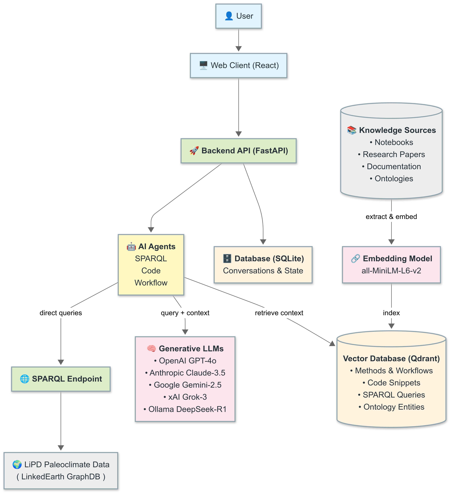

# PaleoPal: A Multi-Agent System for Paleoclimate Data Analysis

<p align="center"></p>

<sub><sup>Diagram source: [`ArchitectureDiagram.mmd`](ArchitectureDiagram.mmd)</sup></sub>

## Technical Architecture Paper

### Abstract

PaleoPal is a sophisticated multi-agent system designed for paleoclimate data analysis, built on a modern microservices architecture. The system combines React-based frontend, FastAPI backend, LangGraph multi-agent framework, and vector database technologies to provide an intelligent, conversational interface for scientific data exploration and analysis. This paper presents the complete technical architecture, design decisions, and implementation details of the PaleoPal system.

### 1. Introduction

PaleoPal addresses the complexity of paleoclimate data analysis by providing a conversational interface that leverages multiple specialized AI agents. The system enables researchers to query, analyze, and visualize paleoclimate data through natural language interactions, automatically generating appropriate SPARQL queries, Python code, and analytical workflows.

#### 1.1 Key Objectives
- **Accessibility**: Lower the technical barrier for paleoclimate data analysis
- **Intelligence**: Leverage AI agents for automated query generation and code synthesis
- **Scalability**: Support concurrent users and large-scale data processing
- **Extensibility**: Modular architecture enabling easy addition of new capabilities
- **Reliability**: Robust error handling and state management

### 2. System Architecture Overview

PaleoPal follows a layered microservices architecture with clear separation of concerns:

#### 2.1 Architecture Layers
1. **Client Layer**: Web browser interface
2. **Frontend Layer**: React application with nginx proxy
3. **API Gateway Layer**: FastAPI server with middleware
4. **Router Layer**: RESTful API endpoints
5. **Service Layer**: Business logic and orchestration
6. **Multi-Agent System**: LangGraph-based AI agents
7. **Data Storage Layer**: Persistent storage systems
8. **External Integration Layer**: Third-party services and data sources

#### 2.2 Core Components

| Component | Technology | Purpose |
|-----------|------------|---------|
| Frontend | React + Nginx | User interface |
| Backend API | FastAPI | API server |
| Vector Database | Qdrant | Document embeddings |
| Local Database | SQLite | Conversations & state |
| SPARQL Endpoint | GraphDB/Remote | Paleoclimate data |

### 3. Frontend Architecture

PaleoPal's user interface is delivered as a single-page React application served behind an nginx reverse-proxy.  All business logic is handled in the backend; therefore the frontend layer is intentionally lightweight – responsible only for rendering the UI, routing user interactions to `/api/*`, and streaming real-time agent progress updates.

#### 3.1 React Application Structure
The frontend is built with modern React patterns:

```javascript
// Core configuration
const API_CONFIG = {
  BASE_URL: process.env.REACT_APP_API_URL || 
           (process.env.NODE_ENV === 'production' ? '' : 'http://localhost:8000'),
  ENDPOINTS: {
    CONVERSATIONS: '/api/conversations',
    MESSAGES: '/api/messages',
    AGENTS: '/api/agents',
    LIBRARIES: '/api/libraries',
    EXTRACT: '/api/extract'
  }
};
```

#### 3.2 Nginx Proxy Configuration
The frontend uses nginx as a reverse proxy to handle API routing:

```nginx
location /api/ {
    proxy_pass http://backend:8000/api/;
    proxy_set_header Host $http_host;
    proxy_set_header X-Real-IP $remote_addr;
    proxy_set_header X-Forwarded-For $proxy_add_x_forwarded_for;
    proxy_set_header X-Forwarded-Proto $scheme;
    proxy_redirect off;
    proxy_buffering off;
}
```

#### 3.3 Key Features
- **Responsive Design**: Mobile-first approach with Tailwind CSS
- **Real-time Updates**: WebSocket connections for agent progress
- **Error Handling**: Comprehensive error boundary implementation
- **State Management**: Context-based state management for conversations
- **Component Architecture**: Modular, reusable components

### 4. Backend Architecture

#### 4.1 FastAPI Server Configuration
The backend is built on FastAPI with disabled redirect slashes to prevent Docker proxy issues:

```python
app = FastAPI(
    title="PaleoPal API",
    description="API for paleoclimate data analysis with multi-agent system",
    version="2.0.0",
    redirect_slashes=False  # Prevent Docker proxy issues
)
```

#### 4.2 Router System
The API is organized into functional routers:

- **Conversations Router** (`/api/conversations`): Conversation management
- **Messages Router** (`/api/messages`): Message handling and persistence
- **Agents Router** (`/api/agents`): Agent orchestration and execution
- **Libraries Router** (`/api/libraries`): Vector database search and management
- **Document Extraction Router** (`/api/extract`): Document processing

#### 4.3 Service Layer Architecture
Each router delegates to specialized service classes:

```python
class ConversationService:
    """Handles conversation lifecycle and persistence"""
    
class MessageService:
    """Manages message creation, updates, and retrieval"""
    
class AgentRegistry:
    """Centralized agent management and routing"""
    
class DocumentExtractionService:
    """Processes various document types for knowledge extraction"""
```

### 5. Multi-Agent System

#### 5.1 LangGraph Framework
PaleoPal uses LangGraph for orchestrating multi-agent workflows:

```python
class BaseLangGraphAgent(BaseAgent):
    """Base class for all LangGraph-based agents"""
    
    async def handle_request_streaming(self, request: AgentRequest):
        """Stream agent execution with progress updates"""
        async for update in self.graph.astream(initial_state):
            yield self._format_progress_update(update)
```

#### 5.2 Specialized Agents

##### 5.2.1 SPARQL Generation Agent
- **Purpose**: Generate SPARQL queries for paleoclimate data
- **Input**: Natural language questions
- **Output**: Optimized SPARQL queries with metadata
- **Features**: Query validation, optimization, error handling
- **Execution Flow (LangGraph nodes)**
  1. `get_similar_queries` – searches `sparql_queries` collection for templates that resemble the user question.
  2. `get_entity_matches` – matches ontology entities (`ontology_entities` collection) to key terms in the prompt.
  3. `detect_clarification` – checks if the prompt is ambiguous; if so prepares questions.
  4. `human_clarification_needed` – emits questions back to the UI (terminates cycle until answered).
  5. `process_clarification` – merges human answers, loops back to context-gathering nodes.
  6. `generate_query` – drafts a SPARQL query with the retrieved examples + entities + conversation history.
  7. `execute_query` – sends the draft to LinkedEarth GraphDB and stores results.
  8. `refine_query` – re-runs query generation if execution indicates low result quality.
  9. `finalize` – packages the final query + result preview.

##### 5.2.2 Code Generation Agent
- **Purpose**: Generate Python code for data analysis
- **Input**: Analysis requirements
- **Output**: Executable Python code with dependencies
- **Features**: Import synthesis, error handling, best practices
- **Execution Flow (LangGraph nodes)**
  1. `search_examples` – semantic search over `notebook_snippets` & `readthedocs_docs` for relevant code.
  2. `detect_clarification` – determines if more user info is required.
  3. `human_clarification_needed` – produces clarification questions.
  4. `process_clarification` – merges answers, loops back to `search_examples`.
  5. `generate_code` – composes runnable Python using examples + prior conversation code.
  6. `refine_code` – optional improvement pass triggered by static checks or LLM self-reflection.
  7. `finalize` – returns complete script / notebook cell.

##### 5.2.3 Workflow Generation Agent
- **Purpose**: Create complete analytical workflows
- **Input**: High-level objectives
- **Output**: Multi-step workflows with code and queries
- **Features**: Dependency management, step ordering, validation
- **Execution Flow (LangGraph nodes)**
  1. `extract_request` – parses high-level objective (e.g., "reconstruct temperature for Site X").
  2. `search_context` – pulls steps & snippets from `literature_methods` + `notebook_snippets`.
  3. `detect_clarification` – asks for missing details (e.g., time period, variables).
  4. `human_clarification_needed` – sends questions to the user.
  5. `process_clarification` – integrates responses, loops back to context search.
  6. `generate_plan` – produces ordered workflow with SPARQL + code stubs.
  7. `finalize` – returns JSON+markdown describing each step and dependent code blocks.

#### 5.3 Agent Communication Protocol
Agents communicate through standardized request/response objects:

```python
class AgentRequest(BaseModel):
    agent_type: str
    capability: str
    query: str
    conversation_id: Optional[str]
    metadata: Dict[str, Any] = {}

class AgentResponse(BaseModel):
    status: AgentStatus
    message: str
    result: Optional[Dict[str, Any]]
    conversation_id: Optional[str]
```

### 6. Data Storage Architecture

#### 6.1 SQLite Database Schema
Local persistence uses SQLite with the following tables:

```sql
-- Conversation metadata
CREATE TABLE conversations (
    id TEXT PRIMARY KEY,
    title TEXT,
    created_at TIMESTAMP,
    updated_at TIMESTAMP,
    metadata JSON
);

-- Agent state for LangGraph
CREATE TABLE conversation_states (
    conversation_id TEXT,
    state_data JSON,
    updated_at TIMESTAMP
);

-- Workflow plans
CREATE TABLE workflow_plans (
    id TEXT PRIMARY KEY,
    conversation_id TEXT,
    plan_data JSON,
    created_at TIMESTAMP
);
```

#### 6.2 Qdrant Vector Database
Vector embeddings are stored in Qdrant with specialized collections:

| Collection | Purpose | Document Count |
|------------|---------|----------------|
| `notebook_snippets` | Code snippets (Jupyter notebooks & API docs) | ~25 k |
| `literature_methods` | Methods & workflows (research papers & notebooks) | ~10 k |
| `sparql_queries` | SPARQL query templates (notebooks, docs) | ~1 k |
| `ontology_entities` | Ontology terms & relationships | ~5 k |
| `readthedocs_docs` | General API documentation | ~50 k |

##### 6.2.1 Agent ↔ Collection Mapping

| Agent | Primary Collections Queried |
|-------|-----------------------------|
| **SPARQL Generation Agent** | `sparql_queries`, `ontology_entities` |
| **Code Generation Agent** | `notebook_snippets`, `readthedocs_docs` |
| **Workflow Generation Agent** | `literature_methods`, `notebook_snippets` (for step code), `sparql_queries` (for data access) |

Each agent formulates a semantic search over the relevant collections, retrieves the top-k documents, and injects the retrieved context into its generative LLM prompt (RAG). **In addition to external knowledge, the full conversation history—including any previously generated code cells or SPARQL queries—is appended to the prompt so that agents can iteratively refine and extend earlier results without breaking workflow continuity.**

#### 6.3 SPARQL Endpoint Integration
External paleoclimate data access through configurable SPARQL endpoints:

```python
SPARQL_CONFIG = {
    'endpoint_url': os.getenv('SPARQL_ENDPOINT_URL', 'http://localhost:7200/repositories/LiPDVerse-dynamic'),
    'update_url': os.getenv('SPARQL_UPDATE_URL'),
    'username': os.getenv('SPARQL_USERNAME'),
    'password': os.getenv('SPARQL_PASSWORD'),
    'timeout': int(os.getenv('SPARQL_TIMEOUT', '30'))
}
```

### 7. Document Processing Pipeline

#### 7.1 Supported Document Types
- **Jupyter Notebooks**: Extract code snippets and workflows
- **PDF Research Papers**: Extract methodological information
- **ReadTheDocs Sites**: Crawl and index documentation
- **SPARQL Files**: Parse and categorize queries
- **Ontology Files**: Process RDF/OWL entities

#### 7.2 Extraction Pipeline
```python
async def extract_from_file(self, content: bytes, filename: str, 
                          doc_type: DocumentType, params: Dict[str, Any]):
    """Main extraction pipeline"""
    1. Document type detection
    2. Content preprocessing
    3. Specialized extraction (per document type)
    4. Post-processing and validation
    5. Vector embedding generation
    6. Storage in appropriate Qdrant collection
```

### 8. Deployment Architecture

#### 8.1 Docker Compose Configuration
PaleoPal uses Docker Compose for orchestrated deployment:

```yaml
services:
  qdrant:
    image: qdrant/qdrant:v1.7.0
  backend:
    build: ./backend
    depends_on: [qdrant]
  frontend:
    build: ./frontend
    depends_on: [backend]
```

#### 8.2 Network Architecture
- **Internal Network**: `paleopal-network` for service communication
- **Health Checks**: Automated health monitoring for all services
- **Persistent Volumes**: Data persistence across container restarts

### 9. Security Considerations

#### 9.1 API Security
- **CORS Configuration**: Controlled cross-origin resource sharing
- **Input Validation**: Pydantic model validation for all inputs
- **Error Handling**: Sanitized error responses
- **Rate Limiting**: Planned implementation for production

#### 9.2 Data Security
- **Environment Variables**: Sensitive configuration externalized
- **SPARQL Authentication**: HTTP Basic Auth for protected endpoints
- **Local Storage**: SQLite database with file-level security
- **Network Isolation**: Docker internal networks

### 10. Performance Optimization

#### 10.1 Backend Optimizations
- **Async Processing**: FastAPI async/await throughout
- **Connection Pooling**: Efficient database connections
- **Streaming Responses**: Real-time agent progress updates
- **Caching**: Vector search result caching (planned)

#### 10.2 Frontend Optimizations
- **Code Splitting**: Lazy loading of React components
- **Bundle Optimization**: Webpack optimization for production
- **Nginx Caching**: Static asset caching with appropriate headers
- **Progressive Loading**: Incremental UI updates

### 11. Monitoring and Observability

#### 11.1 Logging Strategy
```python
# Structured logging throughout the system
logger = logging.getLogger(__name__)
logger.info(f"Agent execution started: {agent_type}")
logger.error(f"Error in {operation}: {error}", exc_info=True)
```

#### 11.2 Health Checks
- **Application Health**: `/health` endpoints for all services
- **Database Health**: Connection validation
- **External Service Health**: SPARQL endpoint monitoring
- **Docker Health**: Container-level health checks

### 12. Future Enhancements

#### 12.1 Planned Features
- **Authentication System**: User management and session handling
- **Advanced Analytics**: Usage metrics and performance tracking
- **Plugin Architecture**: Third-party agent integration
- **Distributed Deployment**: Kubernetes support
- **Real-time Collaboration**: Multi-user conversation support

#### 12.2 Scalability Roadmap
- **Horizontal Scaling**: Load balancer integration
- **Database Sharding**: Conversation data partitioning  
- **Agent Pool Management**: Dynamic agent scaling
- **Cache Layer**: Redis integration for session management

### 13. Conclusion

PaleoPal represents a sophisticated integration of modern web technologies, AI frameworks, and scientific data systems. The multi-layered architecture provides both flexibility and robustness, enabling researchers to interact with complex paleoclimate datasets through natural language interfaces.

The system's modular design facilitates easy extension and maintenance, while the Docker-based deployment ensures consistent operation across different environments. The combination of LangGraph agents, vector databases, and RESTful APIs creates a powerful platform for scientific data analysis that can adapt to evolving research needs.

### 14. Technical Specifications

#### 14.1 Technology Stack
- **Frontend**: React 18, Tailwind CSS, Webpack
- **Backend**: FastAPI, Python 3.11, Pydantic
- **Agents**: LangGraph, LangChain, OpenAI/Ollama
- **Databases**: SQLite, Qdrant Vector DB
- **Infrastructure**: Docker, Docker Compose, Nginx
- **External**: SPARQL endpoints, GraphDB

#### 14.2 System Requirements
- **Memory**: 8GB RAM minimum, 16GB recommended
- **Storage**: 20GB for full document libraries
- **CPU**: Multi-core processor for concurrent agent execution
- **Network**: Stable internet for external LLM and SPARQL access

---

*This technical architecture document represents the current state of the PaleoPal system as of 2025. For the latest updates and implementation details, please refer to the project repository.* 